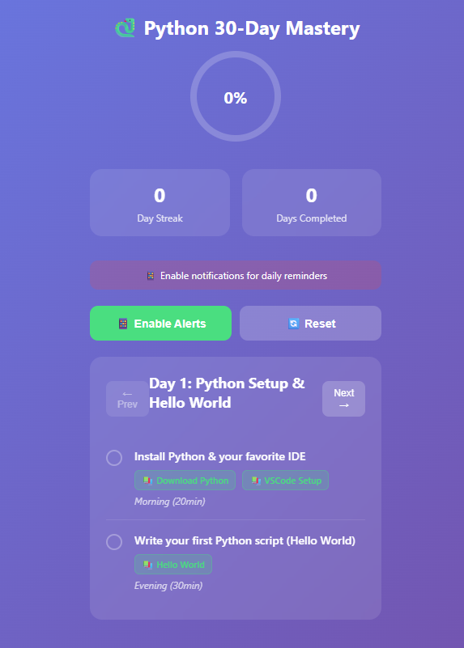

# 🐍 Python 30-Day Mastery Tracker

**Live Demo:** [jb24000.github.io/python-tracker](https://jb24000.github.io/PythonMasteryTracker/)

---

## ✨ Overview

The **Python 30-Day Mastery Tracker** is an interactive, web-based tool designed to help you systematically learn Python in 30 days. Track your daily progress, access curated resources, and stay motivated as you build your Python skills from beginner to advanced.

---

## 🚀 Features

- 📅 **30-Day Curriculum:** Structured daily lessons and challenges.
- ✅ **Progress Tracking:** Mark days as complete and monitor your journey.
- 🔗 **Resource Links:** Direct access to tutorials, documentation, and practice problems.
- 📱 **Responsive Design:** Works seamlessly on desktop and mobile devices.
- 🌙 **Dark Mode:** Eye-friendly interface for comfortable learning.

---

## 📖 Getting Started

### 🌐 View Online

Visit the live site:  
[https://jb24000.github.io/python-tracker/](https://jb24000.github.io/PythonMasteryTracker/)

### 💻 Use Locally

1. Download or clone this repository:
    ```bash
    git clone https://github.com/jb24000/python-tracker.git
    ```
2. Open `index.html` in your web browser.

---

## 🖼️ Screenshots



---

## 🤝 Contributing

Contributions are welcome!  
Feel free to submit issues or pull requests to improve the tracker, add new resources, or suggest features.

---

## 📄 License

This project is licensed under the [MIT License](LICENSE).

---

**Created by [jb24000](https://github.com/jb24000) 🧑‍💻**  
_Inspired by the goal of making Python learning accessible and trackable for everyone._
